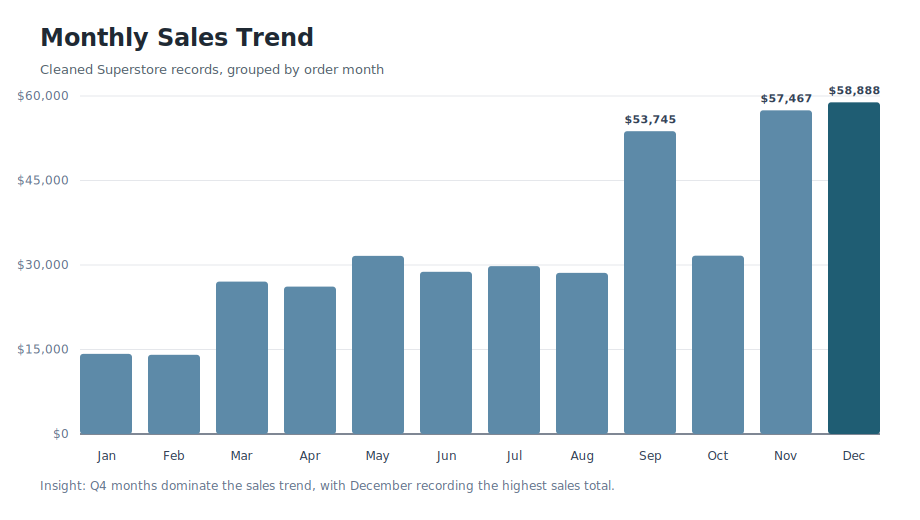
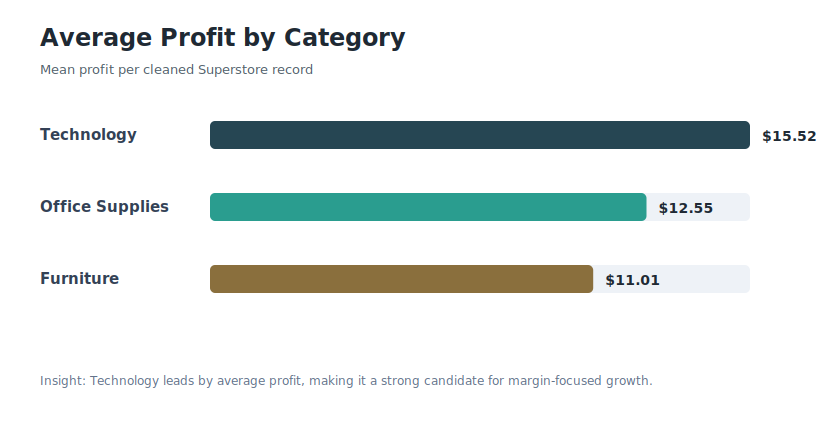
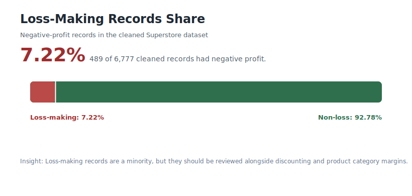

# Superstore Sales Data Analysis

This repository contains a Python data science notebook for analyzing Superstore transactional sales data. The project cleans the raw dataset, explores key business questions, visualizes customer and product behavior, and prepares engineered features for future machine learning workflows.

The analysis is written as a Jupyter Notebook and focuses on practical retail questions around sales, profit, discounts, shipping time, product categories, customer purchasing behavior, and manufacturer performance.

## Project Highlights

- Cleaned and standardized a 9,994-row Superstore dataset.
- Produced a cleaned 6,777-row analysis dataset after missing-value handling, duplicate removal, and outlier filtering.
- Answered 13 business questions using pandas aggregations and descriptive analytics.
- Built visualizations for top customers, loss-making orders, product frequency, sales by category, monthly sales, order volume, shipping time, and sales vs. profit.
- Added feature engineering steps for shipping time, year/month extraction, min-max scaling, one-hot encoding, and label encoding.

## Key Questions Answered

- Which customer generated the highest total purchases?
- What percentage of orders resulted in a loss?
- Which product was purchased most frequently?
- Which product category had the highest average profit per order?
- What was the average shipping time?
- How many orders had discounts of 20% or more?
- How did order volume change year over year?
- Which month generated the highest total sales?
- Which manufacturer generated the highest total sales?

## Selected Findings

- The top customer by total purchases was `paul prost`, with total sales of 1,914.63.
- 7.22% of cleaned order records resulted in negative profit.
- `staple envelope` was the most frequently purchased product.
- `technology` had the highest average profit per order.
- The average shipping time was 3.96 days.
- 44.41% of orders had a discount of 20% or more.
- December had the highest total sales.
- Order count increased from 781 orders in 2019 to 1,368 orders in 2022.

## Visual Summary







## Repository Structure

```text
superstore_sales_analysis.ipynb   Main analysis notebook
superstore_dataset.csv   Raw Superstore dataset
cleaned_data.csv         Cleaned output dataset generated by the notebook
docs/insights.md         Business recommendations based on the analysis
docs/assets/             Exported chart summaries
requirements.txt         Python dependencies
```

## Tech Stack

- Python
- Jupyter Notebook
- pandas
- NumPy
- Matplotlib
- Seaborn
- scikit-learn
- Rich

## Getting Started

Clone the repository and install the dependencies:

```bash
pip install -r requirements.txt
```

Open the notebook:

```bash
jupyter notebook superstore_sales_analysis.ipynb
```

Run the notebook from top to bottom. The notebook reads `superstore_dataset.csv`, performs the cleaning pipeline, exports `cleaned_data.csv`, and then runs the analysis and visualization sections.
